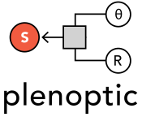
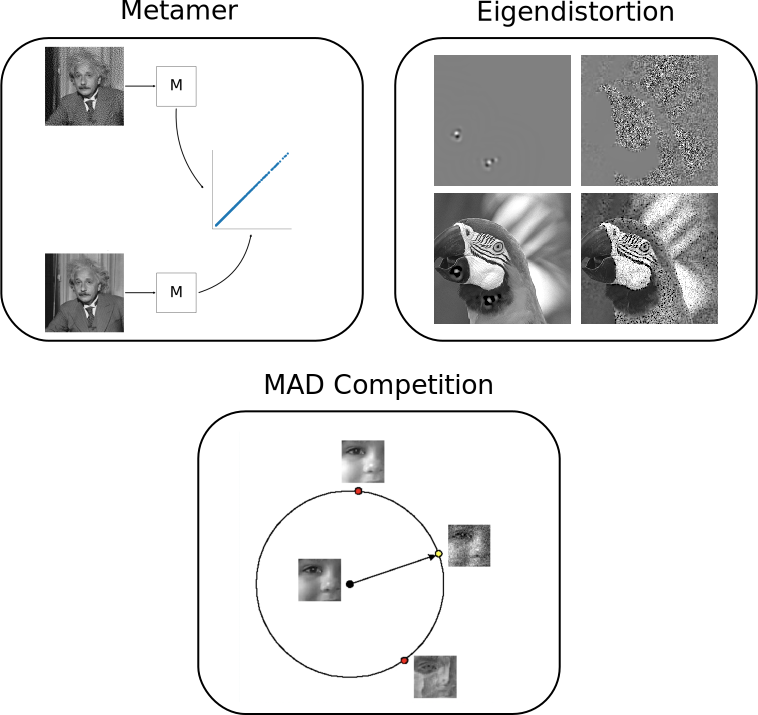

# plenoptic

[](https://github.com/LabForComputationalVision/plenoptic/blob/main/LICENSE)

[](https://github.com/LabForComputationalVision/plenoptic/actions?query=workflow%3Abuild)
[](https://plenoptic.readthedocs.io/en/latest/?badge=latest)
[](https://doi.org/10.5281/zenodo.3995057)
[](https://codecov.io/gh/LabForComputationalVision/plenoptic)
[](https://github.com/LabForComputationalVision/plenoptic/actions?query=workflow%3Atutorials)
[](https://mybinder.org/v2/gh/LabForComputationalVision/plenoptic/main?filepath=examples)



`plenoptic` is a python library for model-based stimulus synthesis. It
provides tools to help researchers understand their model by
synthesizing novel informative stimuli, which help build intuition for
what features the model ignores and what it is sensitive to. These
synthetic images can then be used in future perceptual or neural
experiments for further investigation.

## Getting started

-   If you are unfamiliar with stimulus synthesis, see the [conceptual
    introduction](https://plenoptic.readthedocs.io/en/latest/conceptual_intro.html)
    for an in-depth introduction.
-   If you understand the basics of synthesis and want to get started
    using `plenoptic` quickly, see the
    [Quickstart](tutorials/00_quickstart.nblink) tutorial.

### Installation

The best way to install `plenoptic` is via `pip`. For now, you must do
this from github directly:

``` bash
$ pip install git+https://github.com/LabForComputationalVision/plenoptic.git
```

See the [installation
page](https://plenoptic.readthedocs.io/en/latest/install.html) for more details,
including how to set up a virtual environment and jupyter.

### ffmpeg and videos

Several methods in this package generate videos. There are several backends
possible for saving the animations to file, see [matplotlib
documentation](https://matplotlib.org/stable/api/animation_api.html#writer-classes)
for more details. In order convert them to HTML5 for viewing (and thus, to view
in a jupyter notebook), you'll need [ffmpeg](https://ffmpeg.org/download.html)
installed and on your path as well. Depending on your system, this might already
be installed.

To change the backend, run `matplotlib.rcParams['animation.writer'] = writer`
before calling any of the animate functions. If you try to set that `rcParam`
with a random string, `matplotlib` will tell you the available choices.

## Contents

### Synthesis methods



-   [Metamers](tutorials/06_Metamer.nblink): given a model and a
    reference image, stochastically generate a new image whose model
    representation is identical to that of the reference image. This
    method investigates what image features the model disregards
    entirely.
-   [Eigendistortions](tutorials/02_Eigendistortions.nblink): given a
    model and a reference image, compute the image perturbation that
    produces the smallest and largest changes in the model response
    space. This method investigates the image features the model
    considers the least and most important.
-   [Maximal differentiation (MAD)
    competition](tutorials/07_MAD_Competition.nblink): given two metrics
    that measure distance between images and a reference image, generate
    pairs of images that optimally differentiate the models.
    Specifically, synthesize a pair of images that the first model says
    are equi-distant from the reference while the second model says they
    are maximally/minimally distant from the reference. Then synthesize
    a second pair with the roles of the two models reversed. This method
    allows for efficient comparison of two metrics, highlighting the
    aspects in which their sensitivities differ.
-   [Geodesics](tutorials/05_Geodesics.nblink): given a model and two
    images, synthesize a sequence of images that lie on the shortest
    ("geodesic") path in the model's representation space. This
    method investigates how a model represents motion and what changes
    to an image it consider reasonable.

### Models, Metrics, and Model Components

-   Portilla-Simoncelli texture model, which measures the statistical properties
    of visual textures, here defined as "repeating visual patterns."
-   Steerable pyramid, a multi-scale oriented image decomposition. The basis are
    oriented (steerable) filters, localized in space and frequency. Among other
    uses, the steerable pyramid serves as a good representation from which to
    build a primary visual cortex model. See the [pyrtools
    documentation](https://pyrtools.readthedocs.io/en/latest/index.html) for
    more details on image pyramids in general and the steerable pyramid in
    particular.
-   Structural Similarity Index (SSIM), is a perceptual similarity metric,
    returning a number between -1 (totally different) and 1 (identical)
    reflecting how similar two images are. This is based on the images'
    luminance, contrast, and structure, which are computed convolutionally
    across the images.
-   Multiscale Structrual Similarity Index (MS-SSIM), is a perceptual similarity
    metric similar to SSIM, except it operates at multiple scales (i.e.,
    spatial frequencies).
-   Normalized Laplacian distance, is a perceptual distance metric based on
    transformations associated with the early visual system: local luminance
    subtraction and local contrast gain control, at six scales.

## Getting help

We communicate via several channels on Github:

-   [Discussions](https://github.com/LabForComputationalVision/plenoptic/discussions)
    is the place to ask usage questions, discuss issues too broad for a
    single issue, or show off what you've made with plenoptic.
-   If you've come across a bug, open an
    [issue](https://github.com/LabForComputationalVision/plenoptic/issues).
-   If you have an idea for an extension or enhancement, please post in the
    [ideas
    section](https://github.com/LabForComputationalVision/plenoptic/discussions/categories/ideas)
    of discussions first. We'll discuss it there and, if we decide to pursue it,
    open an issue to track progress.
-   See the [contributing guide](CONTRIBUTING.md) for how to get involved.

In all cases, please follow our [code of conduct](CODE_OF_CONDUCT.md).

## Support

This package is supported by the Simons Foundation Flatiron Institute's Center
for Computational Neuroscience.


